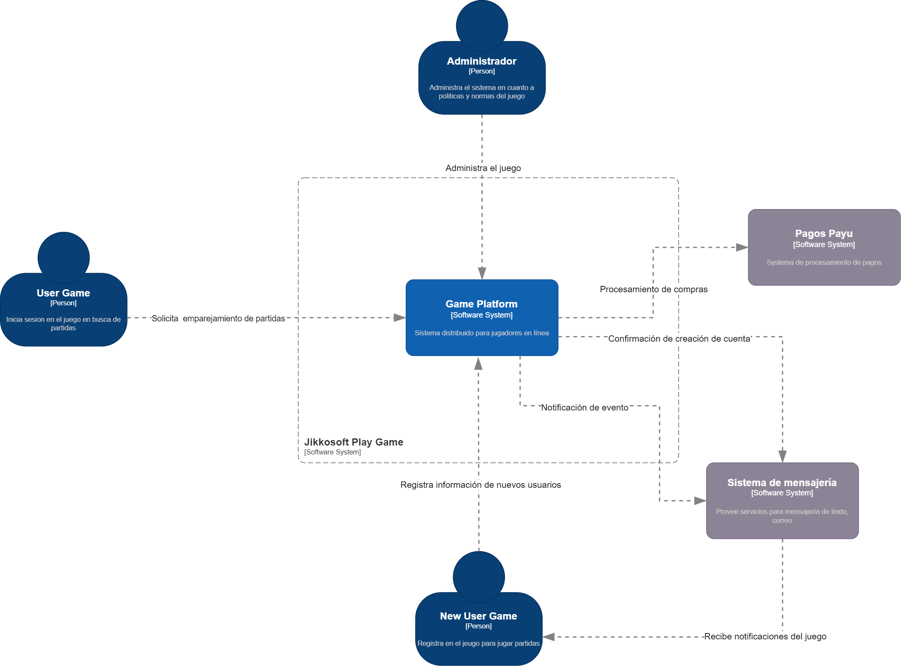
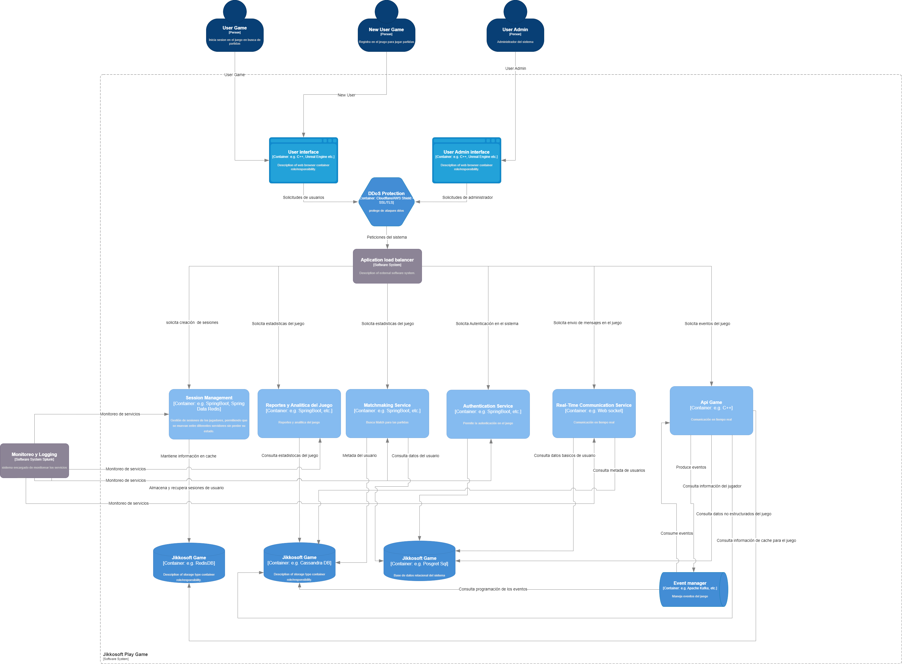
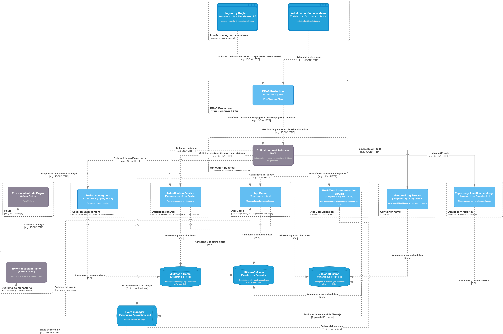
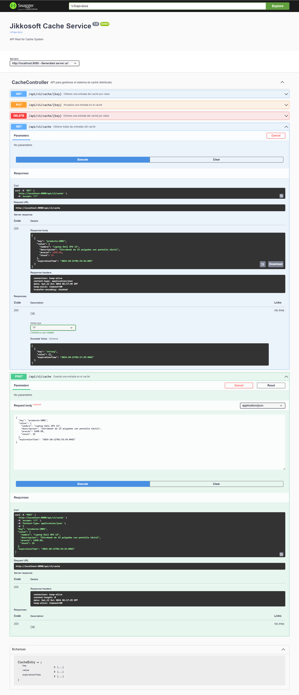

# Cachesystem Jikkosoft

Este proyecto implementa una solución de cache distribuida, utilizando una arquitectura de puertos y adaptadores (Hexagonal) con Spring Boot y Redis.

## Índice

1. [Descripción General](#descripción-general)
2. [Arquitectura](#arquitectura)
3. [Diagrama de Contexto](#diagrama-de-contexto)
4. [Diagrama de Contenedores](#diagrama-de-contenedores)
5. [Diagrama de Componentes](#diagrama-de-componentes)
6. [Configuración](#configuración)
7. [Git Flow](#git-flow)
8. [Dependencias del proyecto](#dependencias-del-proyecto)
9. [Licencia](#licencia)

## Descripción General

El proyecto **Cachesystem Jikkosoft** Cachesystem es una solución de caché distribuido implementada con Spring Boot y Redis, utilizando una arquitectura hexagonal. El sistema está diseñado para almacenar, recuperar, actualizar e invalidar datos de manera eficiente en un entorno distribuido, con soporte para caducidad y mecanismos de invalidación. Además, se han aplicado principios de Clean Architecture y desarrollo ágil, asegurando modularidad y facilidad de mantenimiento.

## Arquitectura

La solución implementa una Arquitectura Hexagonal (también conocida como Ports and Adapters) para asegurar un desacoplamiento claro entre la lógica de negocio y las capas de infraestructura, promoviendo la extensibilidad y facilidad de pruebas. Las capas se organizan de la siguiente manera:

- **Domain**: 
   **Propósito**: Contiene las entidades y la lógica de negocio central del sistema. Esta capa no depende de ninguna tecnología externa ni de detalles de implementación, lo que la hace altamente reutilizable y fácil de probar.
   **Propósito**: Define las reglas de negocio del sistema y los objetos de dominio, como los modelos de datos. Los puertos de salida se definen aquí, especificando qué comportamientos deben implementarse en la capa de infraestructura.
- **Application**: 
   **Propósito**: Contiene la lógica de la aplicación y los casos de uso, que son las operaciones concretas que orquestan los flujos de negocio. Esta capa interactúa con la capa de dominio para ejecutar la lógica de negocio, y con la infraestructura para cumplir con los requerimientos del sistema.
   **Responsabilidad**: Orquestar las interacciones entre la capa de dominio y la infraestructura. Contiene los servicios de aplicación que utilizan los puertos de entrada (casos de uso) y salida (repositorios).
- **Infrastructure**: 
   **Propósito**: Maneja las interacciones con los servicios externos, la persistencia de datos, y cualquier detalle tecnológico. Aquí es donde se implementan los adaptadores que interactúan con tecnologías externas, como Redis para el almacenamiento en caché.
   **Responsabilidad**: Implementar los puertos de salida definidos en la capa de dominio. También contiene los controladores REST que exponen la API y manejan las solicitudes HTTP entrantes, además de manejar la configuración de la aplicación.


## Diagrama de Contexto

Este diagrama muestra la interacción de los usuarios con el sistema y los sistemas externos:



## Diagrama de Contenedores

Este diagrama muestra los diferentes contenedores (microservicios, bases de datos, etc.) que componen la aplicación:



## Diagrama de Componentes

Este diagrama detalla los componentes dentro de cada contenedor:




## Configuración

## Git Flow
Este proyecto utiliza git flow para la gestion del branching como se explica en el ejemplo.

Deben existir dos ramas principales para que el flujo de trabajo funcione correctamente:

master
develop
GitFlow creará por defecto los siguiente prefijos para las ramas auxiliares, los cuales ayudan a identificar y tener control en el repositorio:

- feature/
- release/
- hotfix/
- bugfix/
- support/
Se recomienda agregar un prefijo a las etiquetas, por ejemplo, la letra «v» sin comillas.

### Requisitos

- Java 17
- Git
- Redis
## Dependencias del proyecto
1. Spring Boot 3.3.4: Framework principal para construir la aplicación.
2. Spring Data Redis: Integración con Redis para manejo de caché distribuido.
3. Lombok: Generación automática de código boilerplate como getters y setters.
4. Swagger: Documentación automática de las APIs RESTful.

### Instrucciones de Configuración

1. Clona el repositorio:
   ```bash
   git clone https://github.com/raziel214/cachesystem.git
2. Debe tener instalado el ide sts:
   ```bash
   https://spring.io/tools
3. Debe  tener instalado Docker para ejecutar redis:
   ```bash
   https://www.docker.com/products/docker-desktop/

4. Debe  tener ejecutar el siguiente comando para descargar redis:
   ```bash
   docker pull redis
   docker run --name redis-cache -p 6379:6379 -d redis

5. Abrir el proyecto en el properties se debe parametrizar el redis:
   ```bash
   spring.redis.host=localhost
   spring.redis.port=6379
6. Ejecutar la aplicación con el contendor arriba:
   ```bash
   Corre en la Url http://localhost:8080/swagger-ui/index.html#/
   como se muestra en la imagen


